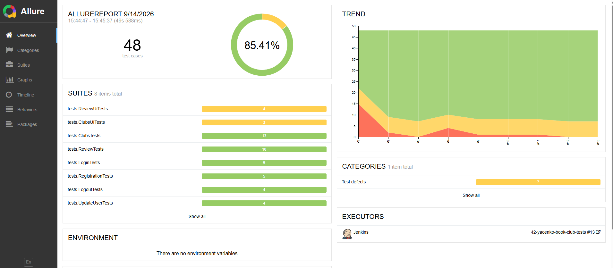
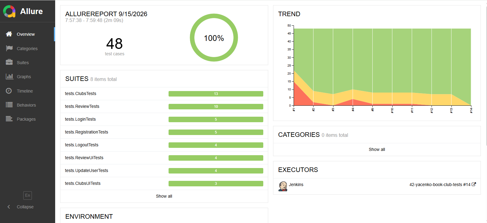

# API Automation Tests

Автотесты для API проекта.

## Стек
- Java 17+
- JUnit 5
- Rest Assured
- AssertJ / Hamcrest
- Allure (отчёты)
- Lombok / Records
- Faker (генерация тестовых данных)

## Запуск тестов
```bash
./gradlew clean test
```
## Просмотр Allure-отчёта
```bash
./gradlew allureReport
./gradlew allureServe
```



## Тесты
- LoginTests — логин (позитивные + негативные)
- RegistrationTests — регистрация (позитивные + негативные)
- LogoutTests — выход (позитивные + негативные)
- UpdateUserTests — обновление профиля (PUT / PATCH)

---